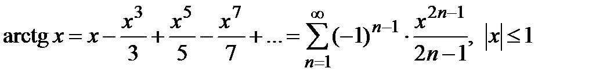

# Индивидуальное домашнее задание 2
Хан Виктория Шижуновна
БПИ226
### Вариант 9
Разработать программу, вычисляющую с помощью степенного
ряда с точностью не хуже 0,05% значение функции arctan (x) для
заданного параметра x.
### План решения

Воспользуемся данным степенным рядом из [данного сайта](https://life-prog.ru/2_78829_lektsiya--ryadi-teylora-i-maklorena.html)
То есть будем каждый раз прибавлять к ответу более высокую степень введенного числа, поделенное на константу. 
Заметим, что по условию нужна точность не хуже 0.05, а это примерно 0.00005. 
При каждой итерации проверяем на точность. Если прибаленное число становится меньше 0.00005, то мы останавливаем цикл

Под данное описание подходит программа с [ответы mail.ru](https://otvet.mail.ru/question/232380363)
```python
EPS = 5e-5
x = float(input())
if abs(x) >= 1:
    print('Значение за пределами диапазона (-1; 1)')
    exit(1)
den = 1
arctg, step = x, x
xx = x * x
while True:
    den += 2
    step = -step * xx / den
    arctg += step
    if abs(step) <= EPS: break
print()
print("%.6f" % arctg)
```

Данную программу возьмем за основу и проверим некоторые значения: 
<table>
    <tr>
        <th>Ввод</th>
        <th>Вывод</th>
    </tr>
    <tr>
        <td>0</td>
        <td>0.0</td>
    </tr>
    <tr>
        <td>0.1</td>
        <td>0.099667</td>
    </tr>
    <tr>
        <td>-0.1</td>
        <td>-0.099667</td>
    </tr>
    <tr>
        <td>0.5</td>
        <td>0.460344</td>
    </tr>
    <tr>
        <td>0.12345</td>
        <td>0.122825</td>
    </tr>
</table>

При вводе числа вне описанного ранее диапазона программа просит повторный ввод пока не будет введено корректное число. 

[Основная программа + тестовые данные](IndHW2/main.asm)

[Подпрограммы](IndHW2/subprograms.asm)
[]()
